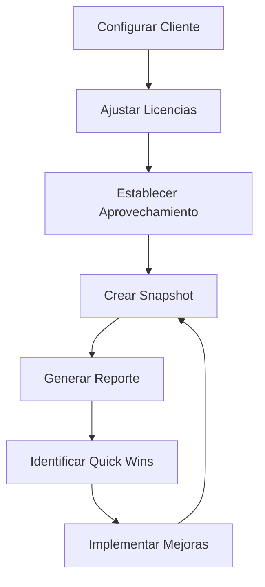

# 🔍 FortiSASE Health Check Dashboard

> **Herramienta de análisis y optimización de aprovechamiento de licencias FortiSASE**

[](https://tu-usuario.github.io/fortisase-healthcheck/)
[](https://github.com/tu-usuario/fortisase-healthcheck/releases)
[](LICENSE)
[](https://github.com/tu-usuario/fortisase-healthcheck/issues/new?template=feedback.md)

## 🎯 ¿Qué es FortiSASE Health Check?

Una herramienta **interactiva y gratuita** que permite a organizaciones analizar el aprovechamiento de sus licencias FortiSASE, identificar oportunidades de optimización y generar reportes ejecutivos para la toma de decisiones estratégicas.

### ✨ Características Principales

- **📊 Dashboard Interactivo**: Visualización en tiempo real del estado de todas las funcionalidades FortiSASE
- **💰 Análisis Financiero**: Cálculo de ROI, costos desperdiciados y oportunidades de ahorro
- **📈 Métricas de Aprovechamiento**: Seguimiento detallado por funcionalidad con benchmarks industriales
- **📋 Reportes Ejecutivos**: Generación automática de resúmenes para C-Level
- **💾 Gestión de Configuración**: Exportación e importación de configuraciones para seguimiento histórico
- **🔄 Snapshots Temporales**: Creación de instantáneas para análisis de tendencias

## 🚀 Demo en Vivo

**[👉 Prueba la herramienta aquí](https://tu-usuario.github.io/fortisase-healthcheck/)**


## 🛠️ Funcionalidades Soportadas

### Core SASE
- ✅ **Secure Internet Access (SIA)** - Acceso seguro a Internet
- ✅ **Secure Web Gateway (SWG)** - Gateway web seguro
- ✅ **Firewall as a Service (FWaaS)** - Firewall basado en nube

### Funcionalidades Avanzadas
- 🔶 **Secure Private Access (SPA)** - ZTNA y SD-WAN
- 🔶 **Cloud Access Security Broker (CASB)** - Control de aplicaciones SaaS
- 🔶 **Data Loss Prevention (DLP)** - Prevención de pérdida de datos

### Protección contra Amenazas
- ✅ **Intrusion Prevention System (IPS)** - Prevención de intrusiones
- ✅ **Advanced Threat Protection** - Sandboxing avanzado

### Funcionalidades Profesionales
- 🔴 **Digital Experience Monitoring (DEM)** - Monitoreo de experiencia
- 🔴 **Remote Browser Isolation (RBI)** - Aislamiento de navegador

**Leyenda**: ✅ Totalmente implementado | 🔶 Parcialmente implementado | 🔴 No implementado

## 📈 Métricas y KPIs

### Indicadores Clave
- **Aprovechamiento Global**: Porcentaje de utilización promedio
- **ROI Efectivo**: Rendimiento real de la inversión
- **Costo de Oportunidad**: Recursos sin aprovechar
- **Benchmark Compliance**: Comparación con estándares industriales

### Análisis Financiero
- **Inversión Total Anual**: Costo total de licencias adquiridas
- **Valor Desperdiciado**: Licencias pagadas pero no utilizadas
- **Potencial de Ahorro**: Optimizaciones identificadas
- **Quick Wins**: Oportunidades de mejora inmediata

## 🏁 Inicio Rápido

### 1. Acceso Directo
```
https://tu-usuario.github.io/fortisase-healthcheck/
```

### 2. Configuración Inicial
1. **Ingresa el nombre de tu organización**
2. **Configura tus licencias actuales** por funcionalidad
3. **Ajusta el aprovechamiento real** basado en tu implementación
4. **Genera tu primer reporte**

### 3. Flujo de Trabajo Recomendado


## 📊 Casos de Uso

### Para Ejecutivos (C-Level)
- **Revisión trimestral de inversión en seguridad**
- **Justificación de presupuesto para ciberseguridad**
- **Comparación con benchmarks industriales**
- **Planificación estratégica de seguridad**

### Para Equipos Técnicos
- **Optimización de configuraciones FortiSASE**
- **Identificación de funcionalidades subutilizadas**
- **Planificación de implementaciones progresivas**
- **Documentación de cambios y mejoras**

### Para Procurement/Finanzas
- **Análisis de valor de proveedores**
- **Optimización de contratos de licencias**
- **Cálculo de TCO (Total Cost of Ownership)**
- **Justificación de renovaciones**

## 🎯 Roadmap y Próximas Funcionalidades

### Versión 1.1 (Q1 2025)
- [ ] **API Integration**: Conexión directa con FortiCloud
- [ ] **Multi-tenant**: Soporte para múltiples organizaciones
- [ ] **Advanced Analytics**: Machine Learning para predicciones
- [ ] **Mobile Support**: Optimización para dispositivos móviles

### Versión 1.2 (Q2 2025)
- [ ] **FortiGate Integration**: Health check para firewalls físicos
- [ ] **FortiAnalyzer Support**: Análisis de logs y eventos
- [ ] **Custom Reporting**: Templates personalizables
- [ ] **SSO Integration**: Autenticación empresarial

### Futuro
- [ ] **Multi-vendor Support**: Palo Alto, Cisco, Zscaler
- [ ] **Compliance Frameworks**: SOC2, ISO27001, NIST
- [ ] **Cost Optimization AI**: Recomendaciones automáticas

## 🤝 Contribuir y Feedback

### 🐛 Reportar Issues
¿Encontraste un problema? [Crea un issue](https://github.com/tu-usuario/fortisase-healthcheck/issues/new?template=bug_report.md)

### 💡 Sugerir Mejoras
¿Tienes ideas para mejorar la herramienta? [Comparte tu feedback](https://github.com/tu-usuario/fortisase-healthcheck/issues/new?template=feedback.md)

### 🔧 Contribuir Código
1. Fork el repositorio
2. Crea una rama para tu feature (`git checkout -b feature/AmazingFeature`)
3. Commit tus cambios (`git commit -m 'Add some AmazingFeature'`)
4. Push a la rama (`git push origin feature/AmazingFeature`)
5. Abre un Pull Request

## 📞 Soporte y Contacto

### 🆘 Necesitas Ayuda?
- **Documentación**: [Wiki del proyecto](https://github.com/tu-usuario/fortisase-healthcheck/wiki)
- **FAQ**: [Preguntas frecuentes](https://github.com/tu-usuario/fortisase-healthcheck/wiki/FAQ)
- **Community**: [Discusiones](https://github.com/tu-usuario/fortisase-healthcheck/discussions)

### 📧 Contacto Directo
- **Email**: tu-email@domain.com
- **LinkedIn**: [Tu Perfil](https://linkedin.com/in/tu-perfil)
- **Twitter**: [@tu-handle](https://twitter.com/tu-handle)

## 🏢 Disclaimer

Esta herramienta es un proyecto **independiente** y **no oficial**. No está afiliada, respaldada o patrocinada por Fortinet Inc. FortiSASE, FortiGate, FortiClient y otros productos mencionados son marcas registradas de Fortinet Inc.

La herramienta está diseñada para **propósitos educativos y de análisis** y debe ser utilizada como complemento a las herramientas oficiales de gestión de Fortinet.

## 📄 Licencia

Este proyecto está licenciado bajo la Licencia MIT - ver el archivo [LICENSE](LICENSE) para más detalles.

## 🙏 Agradecimientos

- **Fortinet Community** por la documentación y recursos
- **Recharts** por las librerías de visualización
- **Tailwind CSS** por el framework de estilos
- **React** por la base de componentes
- **GitHub Pages** por el hosting gratuito

---

<div align="center">

**⭐ Si esta herramienta te resulta útil, considera darle una estrella al repositorio**

Made with ❤️ for the Cybersecurity Community

[🔝 Volver arriba](#-fortisase-health-check-dashboard)

</div>
